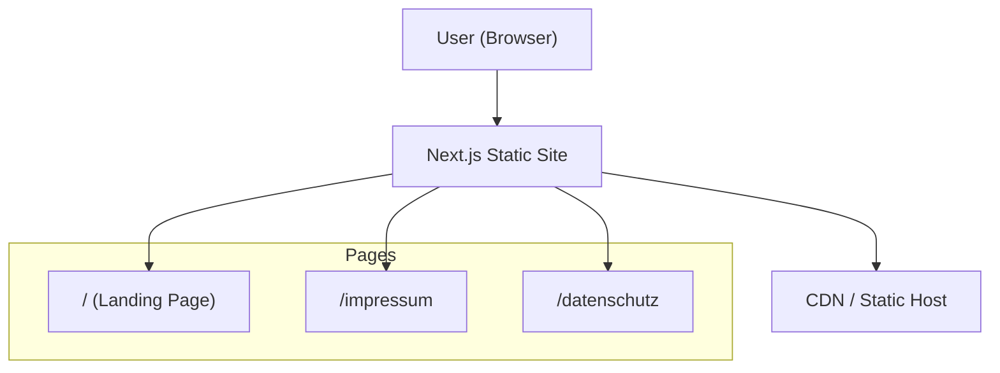
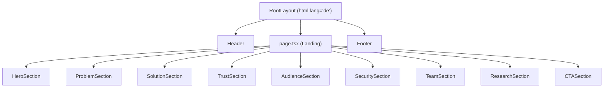

# Architecture – PartiCiv Landing Page

## System Overview

## Component Architecture

## Design Tokens (Planned)
- **Primary**: Deep Blue (#1E3A5F) — Authority, trust, government
- **Accent**: Signal Blue (#2563EB) — CTAs, interactive elements
- **Background**: Cool White (#F8FAFC) — Clean, professional
- **Text**: Near Black (#0F172A) — High readability
- **Typography**: Inter or similar professional sans-serif
